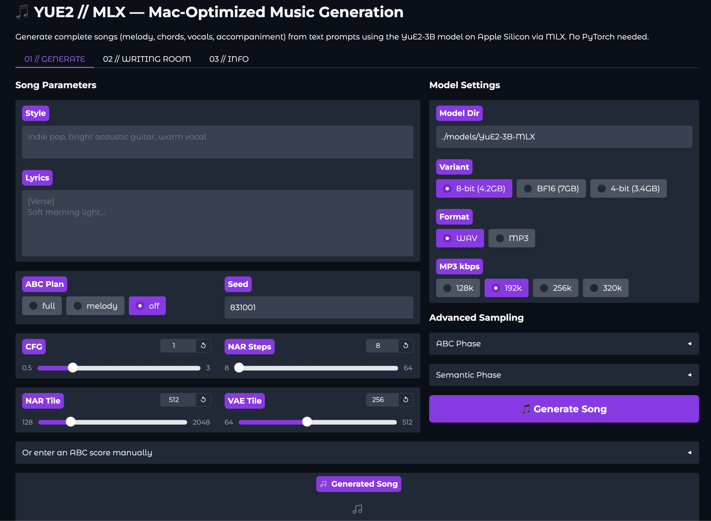
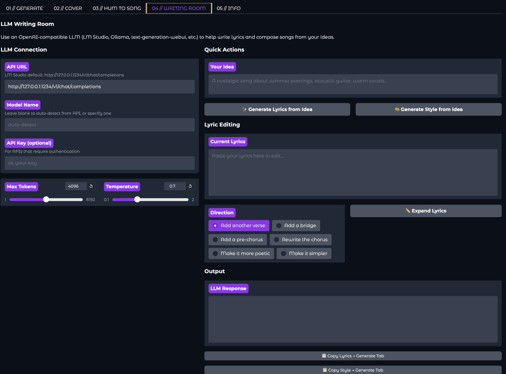

# YUE2 // MLX — Mac-Optimized Music Generation 🎵

<div align="center">


</div>

Generate complete songs (melody, chords, vocals, and accompaniment) from text prompts using the **YuE2-3B** model on **Apple Silicon via MLX**. No PyTorch, no CUDA — pure Metal.

## ✨ What is YUE2 // MLX?

YUE2 // MLX is a Mac-optimized Pinokio app that wraps the **YuE2-3B** music generation model using native **MLX inference** (from [ahmadw/YuE2-3B-MLX](https://huggingface.co/ahmadw/YuE2-3B-MLX)). It features:

- **🎵 Original Song Generation** — Style + lyrics → 48 kHz stereo song
- **📝 LLM Writing Room** — Compose lyrics and styles with LM Studio / Ollama / any OpenAI-compatible API
- **🎼 ABC Score Planning** — Generate editable chord-annotated music scores (full/melody/off modes)
- **⚡ Pure MLX Backend** — No PyTorch, no CUDA dependencies
- **🖥️ Gradio Web UI** —Simple, Beautiful browser interface with progress tracking

## 🍎 Mac-Specific Features

- **Native MLX Inference** — Runs on Apple Metal via MLX framework
- **Three Quantization Options** — BF16 (highest quality), 8-bit (recommended), 4-bit (fastest)
- **Smart Memory Management** — User Configurable VAE TILING | Models range from 3.4 GB (4-bit) to 7 GB (BF16)
- **Less Overhead** — Much lower memory overhead than PyTorch MPS

## 💻 Requirements

| Component | Minimum | Recommended |
|-----------|---------|-------------|
| **Chip** | M1 / M2 / M3 / M4 | M1 Pro/Max or better |
| **RAM** | **16 GB** | **32 GB+** |
| **OS** | macOS 14 (Sonoma) | macOS 15+ (Sequoia) |
| **Storage** | 12 GB Free | 25 GB Free |
| **Generation Time** | ~5-15 min (2 min song) | ~3-8 min |

## 📦 Installation (One-Click)

1. **Download Pinokio:** [pinokio.computer](https://pinokio.computer)
2. **Copy this Repository URL:** `https://github.com/Rdx-ai-art/yue2-mlx.pinokio.git`
3. **Paste into Pinokio:** Discover > Download from URL > paste and select Download
4. **Click Install:** Installs all files, dependencies, selected MLX models will be downloaded during first generation (~4 to ~8 GB)
5. **Click Start:** Launches the Gradio web UI

## 🚀 How to Use

### 1. Generate a Song

1. Go to **01 // GENERATE** tab
2. Enter a **Style** description (e.g., "indie pop, bright acoustic guitar, warm lead vocal")
3. Enter **Lyrics** with section tags:
   ```
   [Verse]
   Soft morning light is touching the window
   
   [Chorus]
   Stay with the rhythm, let it carry us home
   ```
4. Choose **Symbolic Planning** mode:
   - **full** — generates chord-annotated ABC score (recommended)
   - **melody** — melody-only ABC score
   - **off** — skip ABC, generate directly
5. Click **🎵 Generate Song** and wait

### 2. Use the LLM Writing Room

1. Go to **02 // WRITING ROOM** tab
2. Set your **API URL** (LM Studio default: `http://127.0.0.1:1234/v1/chat/completions`)
3. Describe your idea and click:
   - **✨ Generate Lyrics from Idea** — creates full lyrics
   - **🎨 Generate Style from Idea** — creates a style description
4. Use **Expand Lyrics** to add verses, bridges, or rewrite sections
5. Use **Copy Lyrics**, **Copy Style** to copy them back to generate tab respectively.

### 3. Adjust Model Settings

- **Model Variant** — Choose between BF16 (best quality), 8-bit (recommended), or 4-bit (fastest)
- **NAR Steps** — More steps = better audio quality but longer generation (default: 8)
- **CFG Scale** — Higher values follow the prompt more strictly (default: 1.0)
- **Seed** — Set for reproducible results (default: 831001)
- **VAE Tile** — Set for lowering memory usage.Default is good enough for most users.
- **NAR Tile** — Optional method to further lower memory usage at the expense of much lower quality output. Experimental.

## 📸 Screenshots

### GENERATE Tab


### LLM Writing Room


### Generated Audio Output


## 🔧 API Documentation

### Python API

```python
from mlx_inference import Yue2PipelineMLX, ModelVariant

# Load model
pipe = Yue2PipelineMLX("./models/YuE2-3B-MLX", variant=ModelVariant.EIGHT_BIT)

# Generate song
result = pipe(
    style="indie pop, warm vocal",
    lyrics="[Verse]\nSoft morning light...\n[Chorus]\nStay with the rhythm...",
    cot="full",
    seed=831001,
)

# result["audio"] — numpy array (48 kHz stereo)
# result["abc"] — generated ABC score (str)
```

### CLI

```bash
python app.py --host 127.0.0.1 --port 7860
```

### HTTP API (Gradio)

Once running, the Gradio API is available at `http://127.0.0.1:<port>/api/docs`

## 📁 Project Structure

```
yue2-mlx.pinokio.git/
├──  app.py                    # Gradio web UI
├──  mlx_inference.py          # MLX inference wrapper
├──  yue2_model.py             # AR/NAR Mixture-of-Transformers backbone in MLX.
├──  yue2_vae.py               # Oobleck VAE decoder in MLX
├── install.js                # Pinokio install script
├── start.js                  # Pinokio start script
├── update.js                 # Pinokio update script
├── reset.js                  # Pinokio reset script
├── pinokio.js                # Pinokio UI menu
├── pinokio.json              # Pinokio metadata
├── .gitignore
├── README.md
└── models/YuE2-3B-MLX/       # Downloaded during install
    ├── bf16/                 # BF16 model (7 GB)
    ├── 8bit/                 # 8-bit model (4.2 GB)
    └── 4bit/                 # 4-bit model (3.4 GB)
```

## 🐛 Troubleshooting

- **Model not found** — Run Install again to download model weights
- **Out of memory** — Switch to 4-bit variant in the UI
- **Slow generation** — Reduce NAR Steps from 32 to 16 (lower quality)
- **LM Studio connection** — Make sure LM Studio is running and listening on the configured API URL
- **MLX import error** — Ensure you're on Apple Silicon (this app won't work on Intel Macs)

## 📄 License

- **Model weights:** CC BY-NC 4.0 (derived from m-a-p/YuE2-3B and YuE2-Vae)
- **This app:** Apache-2.0

## 🙏 Credits

- **YuE2 Model:** [multimodal-art-projection/YuE](https://github.com/multimodal-art-projection/YuE)
- **MLX Port:** [ahmadw/YuE2-3B-MLX](https://huggingface.co/ahmadw/YuE2-3B-MLX)
- **Gradio UI:** Inspired by [yue2-groove](https://github.com/deadjoe/yue2_groove)
- **Pinokio:** [pinokio.computer](https://pinokio.computer)

---

<div align="center">
<i>Made with ❤️ for Mac Musicians</i>
</div>
